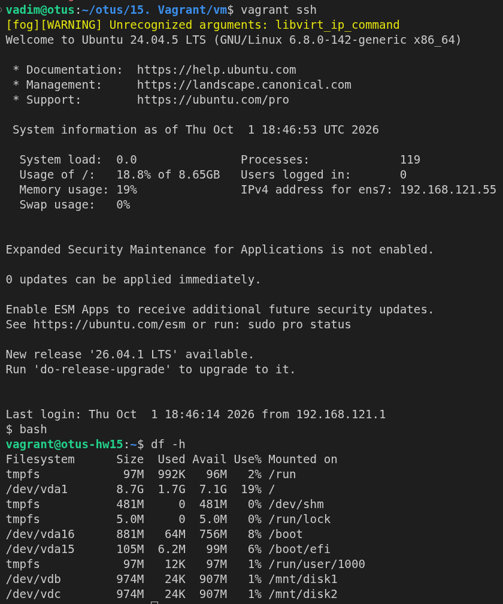
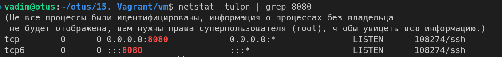

# Vagrant

## Цель

Научиться описывать в Vagrantfile дополнительные диски и проброс портов, а также настраивать диски провижинингом: форматирование, монтирование, fstab.

## Критерии задания

Поднять на Vagrant VM с 1024 МБ памяти и двумя дополнительными дисками по 1 ГБ, пробросить 80 порт гостя на 8080 хоста. Провижининг должен:

- отформатировать добавленные диски в ext4;
- создать точки монтирования `/mnt/disk1` и `/mnt/disk2`;
- смонтировать в них диски;
- добавить записи в `/etc/fstab` для монтирования при загрузке.

Для сдачи нужны Vagrantfile, скриншот `df -h` с запущенной VM и скриншот `netstat -tulpn | grep 8080` с хоста.

## Окружение

- Рабочая станция: Ubuntu 24.04.4 LTS
- KVM/libvirt 10.0.0, QEMU 8.2.2
- Vagrant 2.4.9 + `vagrant-libvirt` 0.12.2
  - Vagrant box: `cloud-image/ubuntu-24.04` версии 20260926.0.0 (провайдер libvirt).
- net-tools 2.10 на рабочей станции, ради `netstat`.
- VM `otus-hw15` — Ubuntu 24.04.5 LTS:
  - ядро 6.8.0-142-generic
  - e2fsprogs 1.47.0
  - 2 ядра
  - 1 ГБ ОЗУ
  - системный диск 10 ГБ (`vda`) и два дополнительных по 1 ГБ (`vdb`, `vdc`)

### Каталоги и файлы

|Файл/Каталог|Назначение|
|---|---|
|`README.md`|Этот файл. Пошагово описывает выполнение задания|
|`vm/Vagrantfile`|Стенд: одна VM с двумя дополнительными дисками и пробросом порта|
|`vm/provision.sh`|Провижининг: поиск дисков, ext4, точки монтирования, fstab|
|`df-h.png`|Скриншот `df -h` в VM|
|`netstat-8080.png`|Скриншот `netstat -tulpn \| grep 8080` с рабочей станции|

### Отличия от методички

`config.vm.disk` в vagrant-libvirt 0.12.2 не работает: плагин эту директиву не читает, ошибки не будет, но и дисков тоже. Для libvirt диски описываются в блоке провайдера через `lv.storage`.

## Выполнение

Все команды `vagrant` выполняю на рабочей станции из папки `vm/`.

### 1. Vagrantfile

```ruby
Vagrant.configure("2") do |config|
  config.vm.box = "cloud-image/ubuntu-24.04"
  config.vm.box_check_update = false
  config.vm.synced_folder ".", "/vagrant", disabled: true

  config.vm.hostname = "otus-hw15"
  config.vm.network "forwarded_port", guest: 80, host: 8080

  config.vm.provider "libvirt" do |lv|
    lv.cpus = 2
    lv.memory = 1024
    lv.machine_virtual_size = 10
    lv.default_prefix = "otus-hw15_"

    lv.storage :file, :size => '1G'
    lv.storage :file, :size => '1G'
  end

  config.vm.provision "shell", path: "provision.sh"
end
```


```bash
vadim@otus:~/otus/15. Vagrant/vm$ vagrant validate
Vagrantfile validated successfully.
```

### 2. Поднимаю стенд и смотрю диски

Сначала поднял VM без провижининга и посмотрел, как гость видит диски:

```bash
$ lsblk -o NAME,SIZE,TYPE,FSTYPE,MOUNTPOINT
NAME     SIZE TYPE FSTYPE MOUNTPOIN
vda       10G disk        
├─vda1     9G part ext4   /
├─vda14    4M part        
├─vda15  106M part vfat   /boot/efi
└─vda16  913M part ext4   /boot
vdb        1G disk        
vdc        1G disk
```

Новые диски — `vdb` и `vdc`: по 1 ГБ, без разделов и файловой системы. Системный `vda` от них отличается размером.

У пользователя `vagrant` в этом образе оболочка `/bin/sh`, то есть `dash`. Строки скрипта с массивами bash, вставленные в неё вручную, падают с `Syntax error: "(" unexpected`. Сам провижининг Vagrant запускает по shebang в bash, там всё работает.

### 3. Провижининг из демо: диски не находятся

За основу взял провижининг из демо `05-disks-and-network.sh` и поменял точки монтирования на `/mnt/disk1` и `/mnt/disk2`. Первый запуск:

```bash
vadim@otus:~/otus/15. Vagrant/vm$ vagrant provision
==> default: Running provisioner: shell...
    default: Running: /tmp/vagrant-shell20261001-108936-hvtvpa.sh
    default: ERROR: ожидалось 2 диска ~1ГБ, нашёл 0
    default: ----- lsblk полностью для диагностики -----
    default: NAME           SIZE MOUNTPOINT TYPE
    default: vda     10737418240            disk
    default: ├─vda1   9662610944 /          part
    default: ├─vda14     4194304            part
    default: ├─vda15   111149056 /boot/efi  part
    default: └─vda16   957350400 /boot      part
    default: vdb      1073741824            disk
    default: vdc      1073741824            disk
    default: -------------------------------------------
The SSH command responded with a non-zero exit status. Vagrant
assumes that this means the command failed. The output for this command
should be in the log above. Please read the output to determine what
went wrong.
```

Диски на месте, но фильтр их не видит. Ошибка в самом демо, от провайдера она не зависит:

```bash
lsblk -dbno NAME,SIZE,MOUNTPOINT,TYPE | awk '$4=="disk" && $3=="" && ...'
```

`awk` по умолчанию делит строку по пробелам и схлопывает пустые колонки. У диска без точки монтирования строка `vdb 1073741824  disk` разбирается всего в три поля: `TYPE` попадает в `$3`, а `$4` пустой. Условие `$4=="disk"` не выполняется ни для одного свободного диска.

Переставил `MOUNTPOINT` в конец списка колонок, чтобы пустое значение не сдвигало остальные, и поправил номера полей:

```bash
DISKS=($(lsblk -dbno NAME,SIZE,TYPE,MOUNTPOINT | awk '$3=="disk" && $4=="" && $2 >= 1000000000 && $2 <= 1200000000 {print "/dev/"$1}' | sort))
```

### 4. Первый успешный провижининг

```bash
vadim@otus:~/otus/15. Vagrant/vm$ vagrant provision
==> default: Running provisioner: shell...
    default: Running: /tmp/vagrant-shell20261001-110312-gcsadn.sh
    default: Найдены диски: /dev/vdb и /dev/vdc
    default: Форматирую /dev/vdb в ext4
    default: mke2fs 1.47.0 (5-Feb-2023)
    default: Discarding device blocks: done         
    default: Creating filesystem with 262144 4k blocks and 65536 inodes
    default: Filesystem UUID: 9837452d-ab2a-4dad-a18a-17e47e6eb3ea
# ... вырезан остальной вывод mkfs для vdb ...
    default: Форматирую /dev/vdc в ext4
    default: mke2fs 1.47.0 (5-Feb-2023)
    default: Discarding device blocks: done         
    default: Creating filesystem with 262144 4k blocks and 65536 inodes
    default: Filesystem UUID: 6a2b324e-76c7-4c86-ad61-716bf4629d0a
# ... вырезан остальной вывод mkfs для vdc ...
    default: ===== df -h по точкам монтирования =====
    default: Filesystem      Size  Used Avail Use% Mounted on
    default: /dev/vdb        974M   24K  907M   1% /mnt/disk1
    default: /dev/vdc        974M   24K  907M   1% /mnt/disk2
    default: ===== /etc/fstab (наши строки) =====
    default: UUID=9837452d-ab2a-4dad-a18a-17e47e6eb3ea /mnt/disk1 ext4 defaults 0 2
    default: UUID=6a2b324e-76c7-4c86-ad61-716bf4629d0a /mnt/disk2 ext4 defaults 0 2
```

### 5. Повторный провижининг падает

Методичка требует, чтобы повторный `vagrant provision` не ломал VM. Проверил:

```bash
vadim@otus:~/otus/15. Vagrant/vm$ vagrant provision
==> default: Running provisioner: shell...
    default: Running: /tmp/vagrant-shell20261001-110507-cvsle9.sh
    default: ERROR: ожидалось 2 диска ~1ГБ, нашёл 0
    default: ----- lsblk полностью для диагностики -----
    default: NAME           SIZE MOUNTPOINT TYPE
    default: vda     10737418240            disk
# ... вырезаны разделы vda ...
    default: vdb      1073741824 /mnt/disk1 disk
    default: vdc      1073741824 /mnt/disk2 disk
    default: -------------------------------------------
The SSH command responded with a non-zero exit status. Vagrant
assumes that this means the command failed. The output for this command
should be in the log above. Please read the output to determine what
went wrong.
```

Диски уже смонтированы, и условие «нет точки монтирования» выкидывает их из выборки. При этом другой защиты это условие не добавляет:

- от повторного форматирования защищает `blkid` перед `mkfs`;
- от дублей в fstab защищает `grep -q "$UUID"`;
- `mount -a` пропускает уже смонтированные файловые системы;
- системный диск отсекается по размеру.

Убрал условие на точку монтирования и саму колонку:

```bash
DISKS=($(lsblk -dbno NAME,SIZE,TYPE | awk '$3=="disk" && $2 >= 1000000000 && $2 <= 1200000000 {print "/dev/"$1}' | sort))
```

Прогнал провижининг несколько раз подряд:

```bash
vadim@otus:~/otus/15. Vagrant/vm$ vagrant provision
==> default: Running provisioner: shell...
    default: Running: /tmp/vagrant-shell20261001-113112-tkuz0f.sh
    default: Найдены диски: /dev/vdb и /dev/vdc
    default: /dev/vdb уже отформатирован: ext4
    default: /dev/vdc уже отформатирован: ext4
    default: ===== df -h по точкам монтирования =====
    default: Filesystem      Size  Used Avail Use% Mounted on
    default: /dev/vdb        974M   24K  907M   1% /mnt/disk1
    default: /dev/vdc        974M   24K  907M   1% /mnt/disk2
    default: ===== /etc/fstab (наши строки) =====
    default: UUID=9837452d-ab2a-4dad-a18a-17e47e6eb3ea /mnt/disk1 ext4 defaults 0 2
    default: UUID=6a2b324e-76c7-4c86-ad61-716bf4629d0a /mnt/disk2 ext4 defaults 0 2
# ... ещё два прогона с таким же выводом ...
vadim@otus:~/otus/15. Vagrant/vm$ vagrant ssh -c "grep -c mnt /etc/fstab"
2
```

Ничего не переформатировано, в fstab по-прежнему две строки.

### 6. Итоговый provision.sh

[`provision.sh`](vm/provision.sh):

```bash
#!/usr/bin/env bash
set -euo pipefail

# поиск добавленных дисков
DISKS=($(lsblk -dbno NAME,SIZE,TYPE | awk '$3=="disk" && $2 >= 1000000000 && $2 <= 1200000000 {print "/dev/"$1}' | sort))

if [ "${#DISKS[@]}" -lt 2 ]; then
  echo "ERROR: ожидалось 2 диска ~1ГБ, нашёл ${#DISKS[@]}"
  echo "----- lsblk полностью для диагностики -----"
  lsblk -bo NAME,SIZE,MOUNTPOINT,TYPE
  echo "-------------------------------------------"
  exit 1
fi

DISK1="${DISKS[0]}"
DISK2="${DISKS[1]}"
echo "Найдены диски: $DISK1 и $DISK2"

# форматирование
for D in "$DISK1" "$DISK2"; do
  if ! blkid "$D" >/dev/null 2>&1; then
    echo "Форматирую $D в ext4"
    mkfs.ext4 -F "$D"
  else
    echo "$D уже отформатирован: $(blkid -o value -s TYPE $D)"
  fi
done

# точки монитрования
mkdir -p /mnt/disk1 /mnt/disk2

UUID1=$(blkid -s UUID -o value "$DISK1")
UUID2=$(blkid -s UUID -o value "$DISK2")

# добавление в fstab
grep -q "$UUID1" /etc/fstab || echo "UUID=$UUID1 /mnt/disk1 ext4 defaults 0 2" >> /etc/fstab
grep -q "$UUID2" /etc/fstab || echo "UUID=$UUID2 /mnt/disk2 ext4 defaults 0 2" >> /etc/fstab

# монтирование
mount -a

# выворд итога
echo "===== df -h по точкам монтирования ====="
df -h | grep -E '/mnt/|Filesystem'
echo "===== /etc/fstab (наши строки) ====="
grep -E 'UUID.*mnt' /etc/fstab
```

В fstab пишу UUID, а не `/dev/vdb`: имена устройств зависят от порядка обнаружения дисков, а UUID принадлежит файловой системе.

## Успех

Диски смонтированы в `/mnt/disk1` и `/mnt/disk2`:



```bash
vadim@otus:~/otus/15. Vagrant/vm$ vagrant ssh -c "df -h | grep mnt"
/dev/vdb        974M   24K  907M   1% /mnt/disk1
/dev/vdc        974M   24K  907M   1% /mnt/disk2
```

Порт 8080 на рабочей станции слушается:



```bash
vadim@otus:~/otus/15. Vagrant/vm$ netstat -tulpn | grep 8080
(Не все процессы были идентифицированы, информация о процессах без владельца
 не будет отображена, вам нужны права суперпользователя (root), чтобы увидеть всю информацию.)
tcp        0      0 0.0.0.0:8080            0.0.0.0:*               LISTEN      108274/ssh
tcp6       0      0 :::8080                 :::*                    LISTEN      108274/ssh
```

Я поднял стенд на KVM/libvirt с двумя дополнительными дисками по 1 ГБ и пробросом 80 → 8080. Провижининг форматирует диски в ext4, монтирует их в `/mnt/disk1` и `/mnt/disk2` и прописывает в fstab по UUID. Повторный запуск ничего не ломает.

Задание выполнено.
