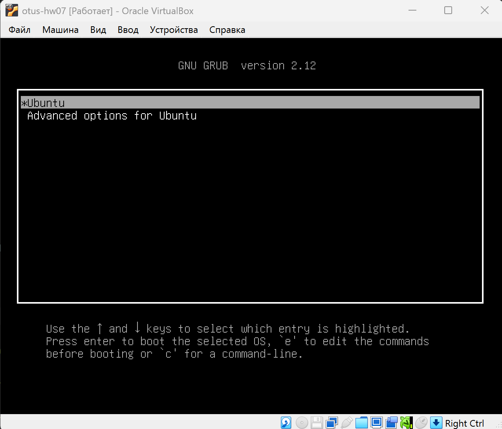
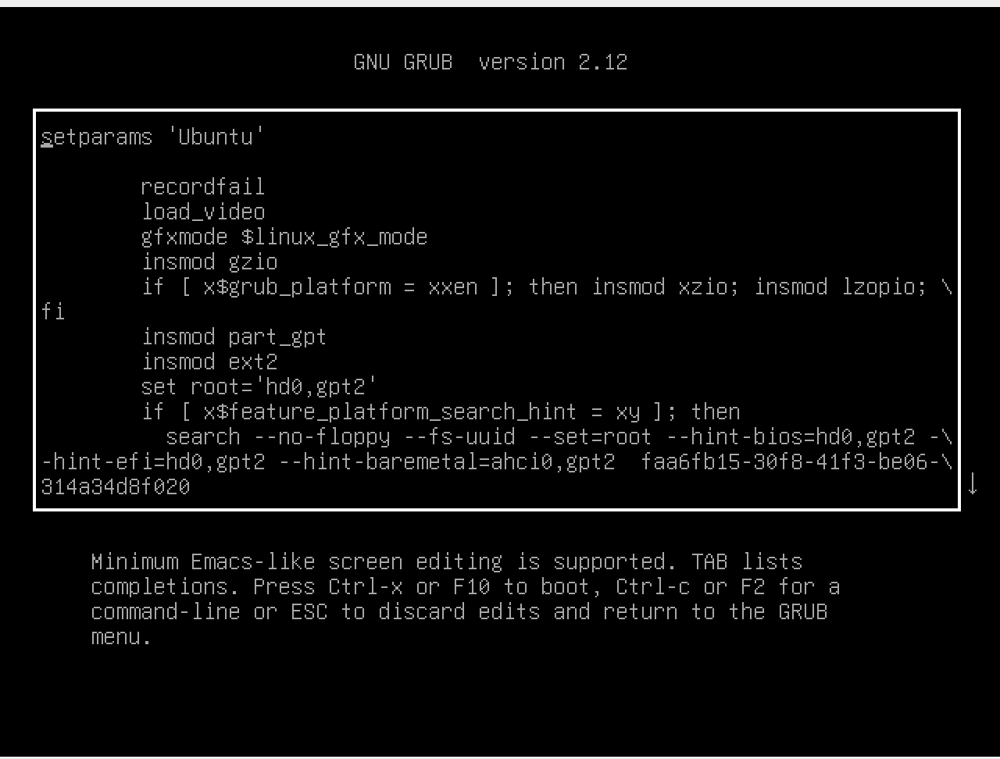
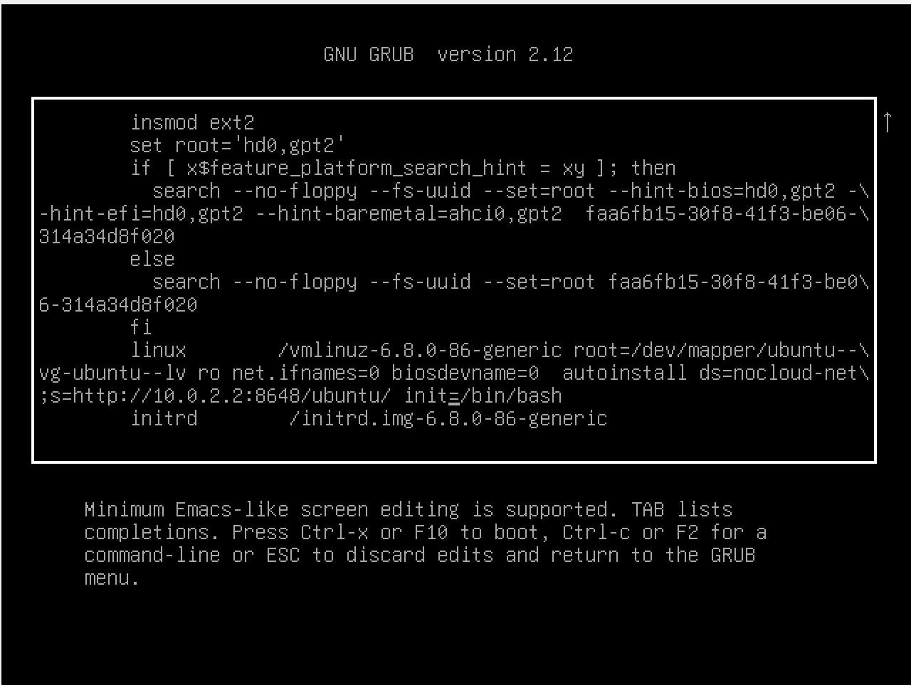
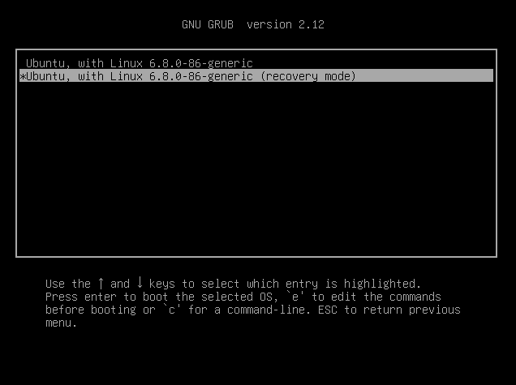
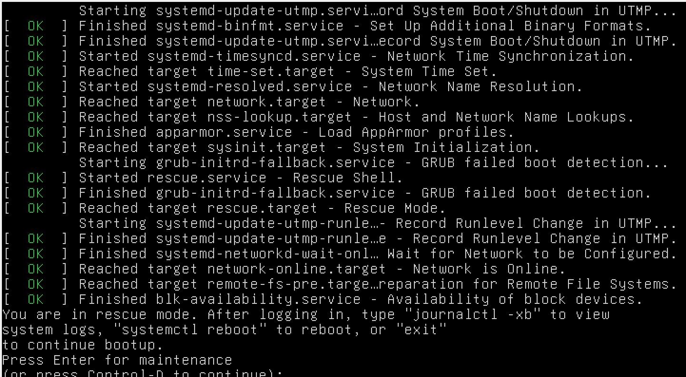
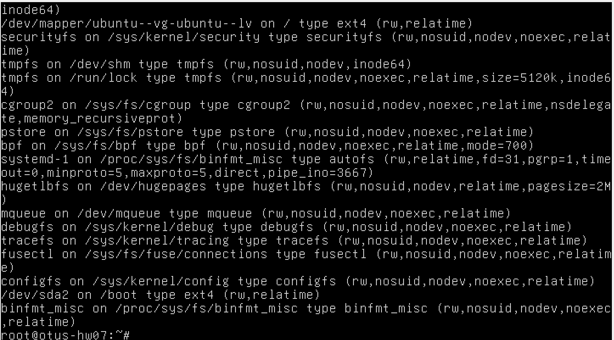

# Работа с загрузчиком

## Цель

- научиться попадать в систему без пароля
- устанавливать систему с LVM и переименовывать в VG

## Текст задания

- Включить отображение меню Grub.
- Попасть в систему без пароля несколькими способами.
- Установить систему с LVM, после чего переименовать VG.

## Окружение

- Хостовая машина: Windows 11.
- VirtualBox 7.2.6 r172322 (Qt6.8.0 on windows)
- Vagrant 2.4.9
  - Vagrant box: `bento/ubuntu-24.04` из локального файла `_boxes/bento-ubuntu-24.04.box`.
- Виртуальная машина Ubuntu 24.04:
  - 2 ядра
  - 4 ГБ ОЗУ

## Выполнение

### Включаю отображение меню Grub

Меню загрузчика Grub по-умолчанию выключено, первым делом включу его.

Открываю файл `/etc/default/grub`
```bash
root@otus-hw07:~# nano /etc/default/grub
```

Комментирую пункт `GRUB_TIMEOUT_STYLE=hidden` и устанавливаю время задержки равным 10 секундам.
```bash
#GRUB_TIMEOUT_STYLE=hidden
GRUB_TIMEOUT=10
```

После чего обновлю конфигурацию загрузчика и перезагружусь для проверки результата.
```bash
root@otus-hw07:~# update-grub
Sourcing file '/etc/default/grub'
Generating grub configuration file ...
Found linux image: /boot/vmlinuz-6.8.0-86-generic
Found initrd image: /boot/initrd.img-6.8.0-86-generic
Warning: os-prober will not be executed to detect other bootable partitions.
Systems on them will not be added to the GRUB boot configuration.
Check GRUB_DISABLE_OS_PROBER documentation entry.
Adding boot menu entry for UEFI Firmware Settings ...
done

root@otus-hw07:~# reboot
```

Наблюдаю за процессом загрузки, вижу, что меню Grub отображается


### Попадаю в систему без пароля

Теперь, когда меню Grub отображается и есть задержка выбора, я могу использовать расширенные опции загрузки.

В данном случае, я из меню Grub нажимаю `e` (edit) и попадаю в меню параметров загрузки.



#### Способ 1. init=/bin/bash

Добавляю `init=/bin/bash` в конец строки, которая начинается с `linux`


После чего нажимаю `F10` или `Ctrl+X` для продолжения загрузки с текущими параметрами.

С первого раза загрузиться не получилось, я так полагаю, что из-за параметров `autoinstall/cloud-init`, которые появляются то ли из-за Vagrant то ли из-за используемого мной образа.

Укоротил строку до необходимого минимума - `linux /vmlinuz-6.8.0-66-generic root=/dev/mapper/ubuntu--vg-ubuntu--lv init=/bin/bash`, после чего смог попасть в `root`

Теперь, согласно рекомендациям из методички, перемонтирую корневую ФС в режим Read-Write

```bash
root@(none):/# mount -o remount,rw /
```

Далее, для проверки, записываю информацию в тестовый текстовый файл и вывожу его содержимое в консоль
```bash
root@(none):/# echo "hello" >> test.txt
root@(none):/# cat test.txt
hello
```

Данные записались, всё работает.

#### Способ 2. Recovery mode

Теперь использую второй способ.
Выбираю `Advanced options for Ubuntu` и выбираю загрузки в `Recovery mode`


У меня почему-то не было `Recovery Menu`, я сразу выпал в консоль `root`


Командой `mount` проверяю, в каком режиме смонтированы ФС, судя по всему `RW`


Раз я в консоли под `root`, значит я могу проводить любые манипуляции с системой. Цель достигнута.

### Переименовываю VG

Система была установлена с LVM, так что сразу смотрю список текущих Volume Group
```bash
root@otus-hw07:~# vgs
  VG        #PV #LV #SN Attr   VSize   VFree 
  ubuntu-vg   1   1   0 wz--n- <62.00g 31.00g
```

Вижу `VG` с именем `ubuntu-vg`, далее переименовываю её в `ubuntu-otus`
```bash
root@otus-hw07:~# vgrename ubuntu-vg ubuntu-otus
  Volume group "ubuntu-vg" successfully renamed to "ubuntu-otus"
```

Теперь вношу правки в `/boot/grub/grub.cfg`. При правке нужно учитывать, что в файле один дефис меняется на два.

```bash
# нахожу вхождения ubuntu--vg
root@otus-hw07:~# grep ubuntu--vg /boot/grub/grub.cfg
        linux   /vmlinuz-6.8.0-86-generic root=/dev/mapper/ubuntu--vg-ubuntu--lv ro net.ifnames=0 biosdevname=0  autoinstall ds=nocloud-net;s=http://10.0.2.2:8648/ubuntu/
                linux   /vmlinuz-6.8.0-86-generic root=/dev/mapper/ubuntu--vg-ubuntu--lv ro net.ifnames=0 biosdevname=0  autoinstall ds=nocloud-net;s=http://10.0.2.2:8648/ubuntu/
                linux   /vmlinuz-6.8.0-86-generic root=/dev/mapper/ubuntu--vg-ubuntu--lv ro single nomodeset dis_ucode_ldr net.ifnames=0 biosdevname=0

# через sed меняю ubuntu--vg на ubuntu--otus 
root@otus-hw07:~# sudo sed -i 's/ubuntu--vg/ubuntu--otus/g' /boot/grub/grub.cfg

# проверяю, что ubuntu--otus появилось там же, где раньше было ubuntu--vg
root@otus-hw07:~# grep ubuntu--otus /boot/grub/grub.cfg
        linux   /vmlinuz-6.8.0-86-generic root=/dev/mapper/ubuntu--otus-ubuntu--lv ro net.ifnames=0 biosdevname=0  autoinstall ds=nocloud-net;s=http://10.0.2.2:8648/ubuntu/
                linux   /vmlinuz-6.8.0-86-generic root=/dev/mapper/ubuntu--otus-ubuntu--lv ro net.ifnames=0 biosdevname=0  autoinstall ds=nocloud-net;s=http://10.0.2.2:8648/ubuntu/
                linux   /vmlinuz-6.8.0-86-generic root=/dev/mapper/ubuntu--otus-ubuntu--lv ro single nomodeset dis_ucode_ldr net.ifnames=0 biosdevname=0

# убаждаюсь, что ubuntu--vg нигде не осталось
root@otus-hw07:~# grep ubuntu--vg /boot/grub/grub.cfg
root@otus-hw07:~
```

Теперь перезагружаюсь.

Загрузка прошла нормально, проверяю имя `VG`
```bash
root@otus-hw07:~# vgs
  VG          #PV #LV #SN Attr   VSize   VFree 
  ubuntu-otus   1   1   0 wz--n- <62.00g 31.00g
```

Загрузка с новым `VG` прошла нормально, в информации фигурирует новый `VG` - задача выполнена.

## Успех

Я научился включать отображение меню `Grub`, управлять временем задержки до автовыбора по-умолчанию, попадать в систему без пароля пользователя двумя способами и переименовывать `VG`, обновляя параметры загрузки для корректной работы системы.

Задание выполнено успешно.
